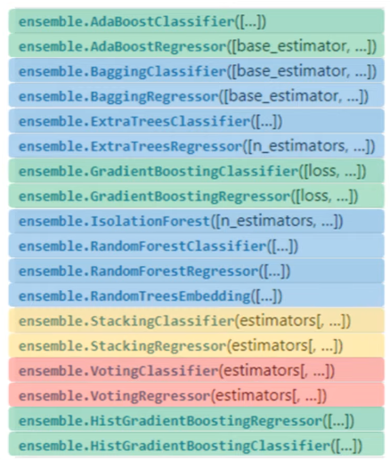

<link rel="stylesheet" href="../../stylesheet.css">

# Story_03 — Random Forest

## Contexte
> Découverte de l'algorithme *Random Forest*.

## Mots clefs
- <def-of>Bagging</def-of> : *Technique d’ensemble qui vise à améliorer la stabilité et la performance des modèles en réduisant la varianc*
- <def-of>Out-Of-Bag</def-of> : *Technique utilisée principalement dans le contexte du bagging, en particulier avec les Random Forests. L'idée derrière l'OOB est de tirer parti de l'échantillonnage avec remplacement effectué lors de la construction de chaque arbre pour évaluer la performance du modèle sans nécessiter un ensemble de validation séparé.*
- <def-of>Random Patches</def-of> : *Technique d'échantillonnage utilisée dans le contexte du bagging, notamment dans les Random Forests. Cette approche consiste à créer plusieurs sous-ensembles aléatoires d'observations et de caractéristiques à partir de l'ensemble d'entraînement complet pour la construction de chaque arbre de la forêt.*
- <def-of>Random Subspaces</def-of> : *Approche qui consiste à introduire de l'aléatoire non seulement en échantillonnant les observations (comme dans l'échantillonnage bootstrap), mais aussi en échantillonnant les caractéristiques (variables) pour la construction de chaque arbre de la forêt.*
- <def-of>RandomForestClassifier</def-of> : *Méthode qui combine les concepts de bagging et des arbres de décision.*
- <def-of>Gradient Boosting</def-of> : *Technique qui consiste à entraîner un modèle fort en agrégeant plusieurs modèles plus faibles*
- <def-of>AdaBoost Algorithm</def-of> : **
- <def-of>Features Importances</def-of> : *L'évaluation de l'impact de chaque caractéristique (ou variable) dans un modèle d'apprentissage machine. Cette mesure est souvent utilisée pour comprendre quelles caractéristiques contribuent le plus à la performance du modèle ou à la prédiction des résultats.*
- <def-of>Underfitting</def-of> : *Problème qui survient lorsqu'un modèle d'apprentissage machine n'est pas en mesure de capturer de manière adéquate les tendances ou les relations sous-jacentes dans les données d'entraînement.*
- <def-of>Majority Voting</def-of> : *Résultalt provenant*
- <def-of>Bootstrap Samling</def-of> : *Technique statistique qui consiste à créer des échantillons d'une population en tirant aléatoirement avec remplacement parmi les observations existantes.*
- <def-of>K-NN Classifier</def-of> : *Algorithme qui prédit l'appartenance d'un exemple à une classe en se basant sur les exemples d'entraînement.*

## Problématiques
1. 

## Hypothèses
- <u>Le boosting peut réduire à la fois la variance et le biais des modèles de base</u> <h-t/> : *!;*
- <u>Trop de modèles de base peuvent entraîner un overfitting</u> <h-t/> : *!;*
- <u></u> <h-t/> : *!;*
- <u></u> <h-t/> : *!;*
- <u></u> <h-t/> : *!;*
- <u></u> <h-t/> : *!;*
- <u></u> <h-t/> : *!;*
- <u></u> <h-t/> : *!;*
- <u></u> <h-t/> : *!;*
- <u></u> <h-t/> : *!;*
- <u></u> <h-t/> : *!;*
- <u></u> <h-t/> : *!;*

## Plan d'action
1. Investigation des ressources
6. Définitions des mots clefs;
7. Vérifier les hypothèses;
8. Répondre aux questions.

# RER

## Difference Bagging/Boosting

|                       | Bagging             | Boosting              |
|-----------------------|---------------------|-----------------------|
| **Modèle**            | fort (overfitting)  | faible (underfitting) |
| **Groupement Réduit** | la variance         | le biais              |

**Stacking** : Au lieu de rassembler les prédictions de chaque modèle... On demande à un dernier estimateur d'apprendre à predire le résultat final en fonction de ces prédictions.

